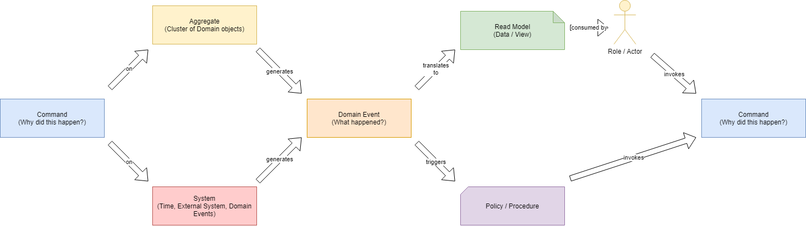
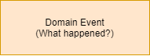
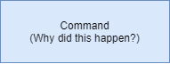
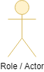
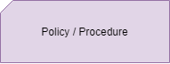
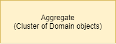
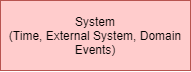
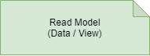

### Was ist Event Storming

* interaktiver Workshop zur Erforschung/zum Verständnis einer Domäne

* Abbildung als Folge von Ereignissen

* Teilnehmer: Fachexperten und IT-Experten

* Fokus auf Konversation und Diskussion

<--->

### Wie sieht das Modell aus

<--->

### Wie läuft ein Workshop ab

1. Use Case vorstellen <!-- .element: class="fragment" -->

2. Domain Events sammeln<!-- .element: class="fragment" -->

3. Domain Events konsolidieren und zeitlich ordnen<!-- .element: class="fragment" -->

4. Commands definieren<!-- .element: class="fragment" -->

5. Auslöser definieren: Actor/Role und Policy<!-- .element: class="fragment" -->

6. Empfänger definieren: Aggregate/System<!-- .element: class="fragment" -->

7. Read Models definieren<!-- .element: class="fragment" -->

<--->

### Was bedeuten die einzelnen Elemente

<-->

* wichtiges fachliches Ereignis im Prozess

* Auslöser für andere Prozesse

* Formulierung in Vergangenheit 

* Beispiel: E-Mail gesendet

<-->

* Aktion, die durchgeführt wird

* Formulierung: Aktiv

*Beispiel: Auftragsbestätigung versenden

<-->

* Akteur/Rolle, die in dem Ablauf etwas tut

* löst Command aus

* reagiert ggf. auf Ausgaben (Read Model)

* Best Practice: Persona

<-->

* automatische Reaktion auf Domain Event

* kann auch zeitliche versetzt erfolgen

* löst Command aus

<-->

* Gruppierung von Domänenobjekten

* führt Command aus 

* triggert Domain Events

<-->

* liegt außerhalb der Domäne

* führt Command aus 

* triggert Domain Events

<-->

* Informationen für Actor/Role

* Ausgabe als Folge von Domain Events